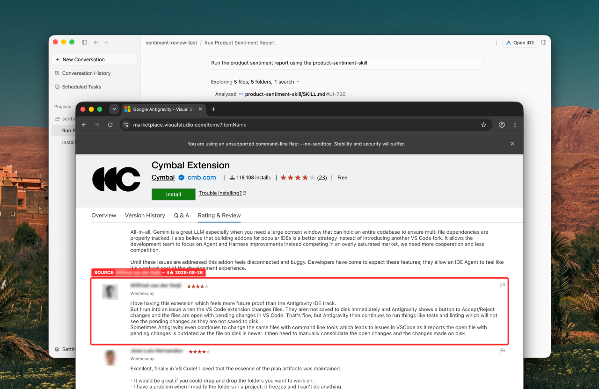
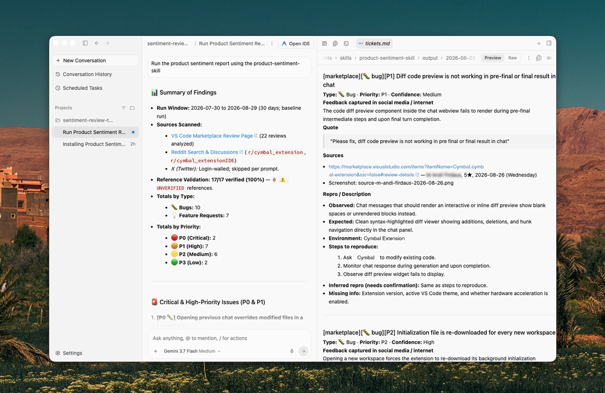

# 📡 Product Sentiment Skill
👤 **Author:** <a href="https://ux.benshishko.eu/" target="_blank" rel="noopener">Ben Shishko</a>


> Turn the internet's noise about your product into a tidy stack of tickets. 🎯

An agent skill that runs a customer-sentiment report for a product. It scans the
social media and review sources you configure for 🐛 bugs, 💡 feature requests,
and 💬 complaints, then hands you prioritized, deduplicated, reference-validated
tickets ready to bulk copy-paste into Buganizer or Jira.


## ✨ What you get

Every run produces two artifacts:

- **`report.md`** — a concise, shareable brief (totals by type/priority, top
  issues, recurring items, sentiment trend, validation summary).
- **`tickets.md`** — copy-paste-ready tickets, one per atomic issue, following
  *your own* bug template.

Plus the smart bits under the hood:

- 🧠 **Memory that escalates** — an append-only ledger so recurring, unfixed
  issues climb in priority instead of getting re-filed as duplicates.
- 🔗 **No hallucinated links** — every reference is fetched and verified before a
  single ticket is written.
- 📸 **Pin-point screenshots** — when a source has no permalink, it captures a
  highlighted screenshot of the exact review.


## 🚀 Install

This is an agent skill. Works best with locally run agents like Google Antigravity, Claude Code, OpenCode, and similar agents that support custom skills.

```
Install the agent skill from https://github.com/limbowalker/product-sentiment-skill
into my agent's skills directory, following that repo's instructions.
```

### 🌐 Browser is required (Playwright MCP)

This skill reads JavaScript-rendered and login-walled pages (marketplaces,
Reddit, X), so it needs real browser tools — the **Playwright MCP server**
(`@playwright/mcp`). You don't have to set this up by hand: on the first run the
skill runs a **browser preflight**, and if the tools are missing it walks you
through configuring Playwright MCP for your specific agent, then continues once
you reload.

If you'd rather configure it up front, add the server (`npx @playwright/mcp@latest`)
to your agent's MCP config, e.g.:

- **OpenCode** — a `playwright` entry under `mcp` in `opencode.json`.
- **Claude Code** — `claude mcp add playwright -- npx @playwright/mcp@latest`.
- **Google Antigravity** — add it in the MCP/extensions settings, or run
  `/browser` in chat to launch a browsing-capable environment.

Requires Node.js/`npx` on your PATH. See the *Browser setup* section in
`SKILL.md` for details.


## ⚙️ Configure

The skill reads three plain-text preference files (in `preferences/`) so you can
tweak behavior without touching the skill itself:

| File | What it does |
| --- | --- |
| 🏷️ `preferences/products.md` | The product name(s) to track. |
| 🌐 `preferences/sources.md` | The URLs to scan. Empty? It falls back to an automatic web search. |
| 📝 `preferences/bug-template.md` | The output format for a single ticket you then may want to copy into your Buganizer, Jira or Asana. |

> 🔒 **Your `preferences/` stay private.** The whole `preferences/` directory is
> git-ignored, so your product names and source URLs are never committed. The
> repo ships **templates with identical filenames** in `templates/`. On first
> run the skill copies `templates/*` → `preferences/*` (same paths, so nothing
> else changes) and then interviews you to fill them in. To reset a file, delete
> it from `preferences/` and re-run.

## ▶️ Run

Trigger it from your agent with a prompt like:

```
Run the product sentiment report using the product-sentiment-skill skill.
```

📂 Output lands in a per-run folder: `output/<YYYY-MM-DD>/`.

## ⏰ Scheduling (optional)

Want it running on autopilot? For macOS `launchd` or `cron`, see
`scheduling/README.md`. Just edit the paths in the provided config to point at
wherever you installed the skill (e.g. `~/path/to/product-sentiment-skill`).

## 👀 See it in action

The skill scans your configured sources and captures the exact reviews it finds —
including a highlighted screenshot when there's no permalink:



Then it produces a prioritized report and copy-paste-ready bug tickets, each with
verified sources, quotes, and repro steps:

